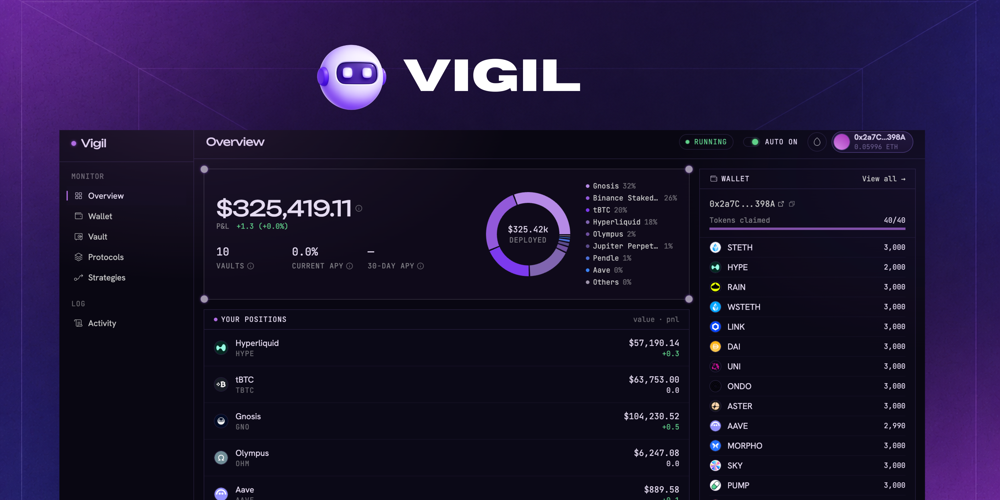
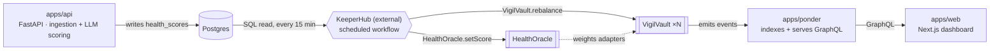

<p align="center">
  <a href="https://vigil.xyz">
    
  </a>
</p>

<p align="center">
  <strong>Autonomous protocol risk monitoring </strong><br />
  Vigil scores DeFi protocol health in real time and automatically reduces exposure before risk becomes loss.
</p>

<p align="center">
  
  
  
  
  
  
</p>

<p align="center">
  
  &nbsp;
  
</p>

<p align="center">
  <a href="./docs/README.md">Docs</a>
  ·
  <a href="./apps/contracts/DEPLOYMENT.md">Deploy Contracts</a>
  ·
  <a href="./docs/keeperhub.md">KeeperHub</a>
  ·
  <a href="https://vigil-vault.up.railway.app/">Web App</a>
  ·
  <a href="./apps/contracts">Contracts</a>
  ·
  <a href="./apps/api">Scoring API</a>
</p>

---

## About

Vigil continuously tracks on-chain and off-chain signals — TVL, liquidations,
governance activity, social sentiment, security disclosures — for a set of
DeFi protocols, and turns them into a single 0–100 health score per protocol.
Deposits sit in ERC-4626 vaults (`VigilVault`) that split funds across
several protocol adapters, weighted by each adapter's current health score.
When a protocol's score drops, the vault's own weighting math pulls exposure
away from it automatically on the next rebalance — no push notification
waiting for a human to act on it.

This repo holds the full stack: the vaults and oracle contracts, the indexer
that makes on-chain state queryable, the scoring backend, and the dashboard.
The piece that closes the loop — actually calling `setScore()` and
`rebalance()` on a schedule — is **KeeperHub**, an external workflow
automation platform. See [Architecture](#architecture) below.

## Features

- **Health scoring.** An LLM synthesizes on-chain and off-chain signals
  (TVL, liquidations, whale flows, governance, news, social sentiment) into a
  0–100 score with plain-language reasoning per protocol — recomputed every
  cycle, not hand-curated.
- **Autonomous rebalancing.** `VigilVault` weights its protocol adapters by
  live health score. A score drop shows up as a position change on the next
  rebalance, not as an alert someone has to act on.
- **KeeperHub-executed, on-chain.** Every score push and rebalance is a real
  on-chain transaction, triggered on a schedule, auditable on Base Sepolia —
  not a simulated or off-chain-only decision.
- **A faucet that doesn't need a funded treasury.** Test tokens mint
  on-demand (`Faucet.sol`) and forward to the caller in the same
  transaction — claim several at once with one signature, no pre-funded pool
  to run dry.

## Architecture



| Layer | What it does | Lives in |
|---|---|---|
| Scoring | Ingests signals, prompts an LLM, persists `{score, reasoning}` to Postgres | [`apps/api`](./docs/api.md) |
| **Execution (external)** | Every 15 min: pushes the latest score on-chain via `HealthOracle.setScore()`, then calls `VigilVault.rebalance()` on every vault | **KeeperHub** — [`docs/keeperhub.md`](./docs/keeperhub.md) |
| On-chain | ERC-4626 vaults, the health oracle, protocol adapters, testnet token faucet | [`apps/contracts`](./apps/contracts) |
| Indexing | Watches every contract event, serves it over GraphQL — how the frontend discovers vaults without polling the chain | [`apps/ponder`](./docs/ponder.md) |
| Frontend | Dashboard, vault detail, protocol health, wallet + faucet UI | [`apps/web`](./docs/web.md) |

The middle row is the one thing that's easy to miss: **nothing in this
repo's own code calls `setScore()` or `rebalance()`.** That loop is real,
it's just configured on KeeperHub rather than written here — an exported
copy of the workflow lives at `vigil-work-flow.workflow.json`. Read
[`docs/keeperhub.md`](./docs/keeperhub.md) before assuming that automation
is either fully in-repo or missing entirely.

## Tech stack

- **Frontend** — Next.js 16 (App Router), TypeScript, Tailwind CSS v4,
  thirdweb (wallet connect + contract calls), TanStack Table, Recharts,
  Drizzle ORM (direct Postgres reads for protocol/score data).
- **Contracts** — Solidity, Foundry, OpenZeppelin (`ERC4626`, `AccessControl`,
  `ReentrancyGuard`), deployed to Base Sepolia.
- **Indexer** — [Ponder](https://ponder.sh), Postgres, GraphQL.
- **Scoring backend** — Python, FastAPI, an LLM via OpenRouter, Redis
  (signal cache), Postgres (score history).
- **Execution** — [KeeperHub](https://www.keeperhub.com) (external, MCP
  workflow automation).
- **Monorepo** — pnpm workspaces + Turborepo.

## Getting started

```bash
git clone https://github.com/ephraimphrase/vigil
cd vigil
pnpm install
```

Two things need to be in place before anything runs:

- **Env files.** Each app needs its own — copy the relevant `.env.example`
  (`apps/web`, `apps/api`, `apps/contracts`) and fill in what it asks for
  before running that app.
- **Docker.** Postgres (indexer + score history) and Redis (signal cache)
  run via the root `docker-compose.yml`:

  ```bash
  docker compose up -d
  ```

**Contracts** (local anvil, or a real testnet with `RPC_URL`/`DEPLOYER_KEY`
set in `apps/contracts/.env`):

```bash
cd apps/contracts
./deploy.sh          # anvil (or a fork) → WETH9 → seed tokens → Faucet →
                      # core stack → syncs addresses/ABIs into apps/web
```

Full walkthrough, including a real Base Sepolia deploy step-by-step:
[`apps/contracts/DEPLOYMENT.md`](./apps/contracts/DEPLOYMENT.md).

**Everything else**, from the repo root:

```bash
pnpm dev              # turbo runs `dev` in every app in parallel
```

Or per app via turbo filters — `pnpm --filter web dev`,
`pnpm --filter ponder dev`, `pnpm --filter contracts chain`. The scoring
API runs separately (`cd apps/api && uvicorn main:app --reload`) and needs
nothing from the JS side to work in isolation.

## Documentation

Start at [`docs/README.md`](./docs/README.md) — it indexes the per-app docs
and walks through how data actually flows end to end, including the two
things that trip up almost everyone new to this repo: `deployedContracts.json`
being the seam every downstream service reads from, and KeeperHub's contract
addresses being hardcoded rather than synced automatically.

| Doc | Covers |
|---|---|
| [`docs/README.md`](./docs/README.md) | Monorepo index, end-to-end data flow |
| [`docs/keeperhub.md`](./docs/keeperhub.md) | The external automation loop, exactly what it triggers and when |
| [`docs/ponder.md`](./docs/ponder.md) | Indexer config, how vaults/adapters get discovered without hardcoding addresses |
| [`docs/web.md`](./docs/web.md) | Frontend routes and its three separate data sources |
| [`docs/api.md`](./docs/api.md) | Scoring backend, and what its own `README.md` gets wrong |
| [`apps/contracts/documentation/`](./apps/contracts/documentation/README.md) | Contract-by-contract reference |
| [`apps/contracts/DEPLOYMENT.md`](./apps/contracts/DEPLOYMENT.md) | Local + Base Sepolia deploy steps |

## License

MIT — see [`LICENCE`](./LICENCE).
